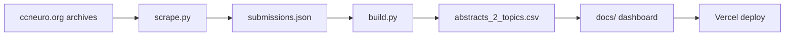

# CCN Visualizer — guide

[README](../README.md) · **Live:** https://ccn-visualizer.vercel.app/

## Workflow



```bash
pip install -r requirements.txt && cp .env.example .env
python scripts/scrape.py && python scripts/build.py
```

Push `main` → Vercel serves `docs/`. Commit `docs/data/abstracts_2_topics.csv` after rebuilds.

## Data

The dashboard loads only `docs/data/abstracts_2_topics.csv` at runtime.

| Source | Use |
|--------|-----|
| [ccneuro.org](https://ccneuro.org) (2017–2026) | Titles, authors, abstracts, keywords, topic areas |
| [CCN 2026 Activity Preferences](https://docs.google.com/forms/d/1c-ZR7PkUNDVeRmncAK2nmdKA5ZwuZ8opTr8Brl-WOJI/viewform) form | 14 research theme names (LLM-assigned labels) |

`data/submissions.json` is the build-time source of truth. `data/embeddings_all.json` stores UMAP coordinates for rebuilds; coordinates are also copied into the CSV.

## Scripts

| Script | Purpose |
|--------|---------|
| `scripts/scrape.py` | Scrape archives → `data/submissions.json` |
| `scripts/build.py` | Classify themes (Anthropic), UMAP, export CSV |
| `scripts/shared.py` | Text cleanup, keyword reconcile, embedding helpers (imported by scrape/build) |
| `scripts/restore_csv_keywords.py` | **Maintenance only:** restore keywords from a historical git snapshot of the CSV |

### scrape.py flags

| Flag | Effect |
|------|--------|
| `--years 2025,2026` | Scrape selected years and merge into existing JSON |
| `--quick` | Scrape 2024–2025 only |
| `--refresh-keywords` | Re-fetch PDFs to mine author keywords |
| `--force-keywords` | Refresh PDF keywords even when author keywords exist |
| `--add-2017` | Include 2017 in a partial scrape |

### build.py flags

| Flag | Effect |
|------|--------|
| `--skip-classify` | Reuse cached LLM theme assignments |
| `--repair-only` | Sanitize text/keywords and rewrite CSV (no API, no UMAP) |
| `--classify-limit N` | Classify only the first N submissions (testing) |
| `--classify-refresh` | Ignore LLM cache and re-classify all |

## Keywords

Keywords shown in the dashboard CSV come from `dashboard_keywords()` in `scripts/shared.py`.

**Priority (first match wins):**

1. **Author keywords** — `Keywords:` field on poster HTML, or proceedings PDF when refreshed
2. **2025 topic areas** — official CCN 2025 conference tracks when author keywords are missing (`YEARS_TOPIC_AREA_KEYWORDS`)
3. **2026 topic areas** — injected at scrape time and comma-split (e.g. `methods | tools | theory & neural coding`)
4. **Extracted keywords** — legacy PDF/title mining for older years when nothing else is available

**Sanitization** (`reconcile_submission_keywords`):

- Strips mojibake, citation fragments, author-name false positives, and implausible tokens
- Conference track names in `METADATA_KEYWORD_PHRASES` are normally blocked as keywords, except for the 2025 topic-area fallback above

Run keyword/text cleanup without re-scraping or re-running UMAP/LLM:

```bash
python scripts/build.py --repair-only
```

## Themes & map

- **Themes:** assigned offline via Anthropic in `build.py` (cached in `data/llm_theme_cache.json`). Dominant + secondary topics. The 14 theme names are defined in `data/google_topics.json` (mirrored in `build.py` and `docs/js/app.js`).
- **Topic filter:** selecting multiple themes requires a submission to match **all** selected themes (AND logic).
- **UMAP:** TF-IDF + UMAP layout only. Dot position = text similarity; dot color = conference year. Does not set theme labels.

## Search

The dashboard search box (`docs/js/app.js`) matches across title, authors, abstract, assigned topics, and keywords. Matching is case- and formatting-insensitive:

- Diacritics and superscripts normalized (`B³` matches `b3`)
- Punctuation and hyphens ignored (`Brain-Body` matches `brain body`)
- Compact mode also matches without spaces (`b3net` matches `B3 net`)

## CI

| Workflow | Use |
|----------|-----|
| **Scrape CCN Data** | Full or partial archive rebuild + build + commit |
| **Update 2026 Data** | `scrape.py --years 2026` + build + commit |

Both require `ANTHROPIC_API_KEY` in repo secrets for theme classification during build.
