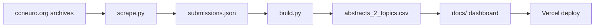

# CCN Visualizer — guide

[README](../README.md) · **Live:** https://ccn-visualizer.vercel.app/

## Workflow



```bash
pip install -r requirements.txt && cp .env.example .env
python scripts/scrape.py && python scripts/build.py
```

Push `main` → Vercel serves `docs/`. Commit `docs/data/abstracts_2_topics.csv` after rebuilds.

**Before deployment:** manually check scraped text, theme labels, and spot-fix outliers in `abstracts_2_topics.csv` / `submissions.json`.

## Data sources

| Source | Use |
|--------|-----|
| [ccneuro.org](https://ccneuro.org) year sites (2017–2026) | Titles, authors, abstracts, keywords, poster metadata |
| [2026.ccneuro.org](https://2026.ccneuro.org) MeetingTrakr search | 2026 listings (detail pages often lack abstracts; prior data used for carry-forward) |
| [CCN 2026 Activity Preferences](https://docs.google.com/forms/d/1c-ZR7PkUNDVeRmncAK2nmdKA5ZwuZ8opTr8Brl-WOJI/viewform) Google Form | 14 research theme names (`data/google_topics.json`) |

Dashboard runtime loads only `docs/data/abstracts_2_topics.csv`.

## Theme assignment (LLM)

| | |
|--|--|
| **Provider** | [Anthropic API](https://www.anthropic.com/) |
| **Model** | `claude-opus-4-6` (override with `ANTHROPIC_MODEL` in `.env`) |
| **When** | Offline in `build.py`, one API call per uncached paper — not at dashboard runtime |
| **Cache** | `data/llm_theme_cache.json`, keyed by `year:id` (CCN reuses numeric IDs across years; file is gitignored) |

**Per paper, the model receives:** the allowed 14 theme names, year, title, abstract, author keywords, and conference track/area when present.

**Not sent:** authors list, poster URL, or UMAP coordinates.

**Returns (JSON):** one `primary_theme` plus up to four `secondary_topics` → stored as `assigned_topics` (dominant first). Invalid or legacy labels are normalized; papers are never left untagged.

**Dashboard use:** the submission list matches any assigned topic; the embedding map colors dots by **conference year** and highlights topic-filter matches. Theme assignment is independent of UMAP — clusters are not used to pick labels.

## Keywords

Author keywords are scraped from poster HTML / proceedings PDFs, then sanitized in `scripts/shared.py` before export:

- Drop sentence fragments, discourse markers, equations, p-values, demographics, citation crumbs, and PDF debris
- Prefer cleaned author keywords; if none remain, fall back to title tokens
- Conference area labels that are generic metadata (e.g. “cognitive science”) are not used as display keywords

Text/keyword cleanup without re-running UMAP or the LLM:

```bash
python scripts/build.py --repair-only
```

## UMAP map (layout only)

Computed in `build.py` for all papers after text cleanup. **Does not affect theme labels.**

1. **Text per paper** — weighted concatenation: title ×2, abstract ×3, cleaned content keywords ×1 (`submission_embedding_text()` in `shared.py`; metadata-only keywords excluded).
2. **TF-IDF** — scikit-learn `TfidfVectorizer`: up to 8000 features, unigrams + bigrams, `min_df=2`, `max_df=0.95`, sublinear TF, custom stop words.
3. **UMAP** — 2D layout with `n_neighbors=15`, `min_dist=0.12`, cosine metric, `random_state=42`.
4. **Export** — `umap_x` / `umap_y` in `abstracts_2_topics.csv`; coordinates also saved to `data/embeddings_all.json`.

Dot position = semantic similarity of title/abstract/keywords. Dot color = conference year.

## Deploy

| | |
|--|--|
| **Host** | [Vercel](https://vercel.com) |
| **Root** | `docs/` (`vercel.json` → `outputDirectory: "docs"`) |
| **Trigger** | Push to `main` |
| **Runtime** | Static HTML/CSS/JS + CSV (no server-side build) |

Legacy doc URLs `/DASHBOARD.md` and `/IMPLEMENTATION.md` redirect to `/GUIDE.md`.

## CI (GitHub Actions)

Manual workflows under `.github/workflows/`:

| Workflow | Purpose |
|----------|---------|
| **Scrape CCN Data** | Optional full or year-filtered scrape → `build.py` → commit data |
| **Update 2026 Data** | Scrape 2026 only → rebuild → commit |

Both require `ANTHROPIC_API_KEY` as a repository secret when classification runs. They commit `data/submissions.json`, `docs/data/abstracts_2_topics.csv`, and `data/embeddings_all.json` (plus `data/google_topics.json` on the full scrape workflow).

## Repo layout (what the site uses)

| Path | Role |
|------|------|
| `docs/index.html` + `docs/js/` + `docs/css/` | Dashboard UI |
| `docs/data/abstracts_2_topics.csv` | Sole runtime dataset |
| `docs/GUIDE.md` | This guide (linked from the site footer) |
| `docs/licenses.html` | Licenses page |
| `data/submissions.json` | Scrape + theme source of truth (not loaded by the browser) |
| `data/embeddings_all.json` | UMAP coordinates for rebuilds |
| `data/google_topics.json` | Canonical 14 theme names |
| `scripts/scrape.py` / `build.py` / `shared.py` | Offline pipeline |
