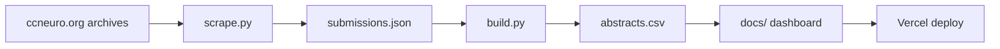

# CCN Visualizer — guide

[README](../README.md) · **Live:** https://ccn-visualizer.vercel.app/

## Workflow



```bash
pip install -r requirements.txt && cp .env.example .env
python scripts/scrape.py && python scripts/build.py
```

Push `main` → Vercel serves `docs/`. Commit `docs/data/abstracts.csv` after rebuilds.

**Before deployment:** manually check scraped text, theme labels, and spot-fix outliers (production data was cleaned this way).

## Data sources

| Source | Use |
|--------|-----|
| [ccneuro.org](https://ccneuro.org) year sites (2017–2026) | Titles, authors, abstracts, keywords, poster metadata |
| [2026.ccneuro.org](https://2026.ccneuro.org) MeetingTrakr search | 2026 listings (detail pages often lack abstracts; prior data used for carry-forward) |
| [CCN 2026 Activity Preferences](https://docs.google.com/forms/d/1c-ZR7PkUNDVeRmncAK2nmdKA5ZwuZ8opTr8Brl-WOJI/viewform) Google Form | 14 research theme names (`data/google_topics.json`) |

Dashboard runtime loads only `docs/data/abstracts.csv`.

## LLM (theme assignment)

| | |
|--|--|
| **Provider** | [Anthropic API](https://www.anthropic.com/) |
| **Model** | `claude-opus-4-6` (override with `ANTHROPIC_MODEL` in `.env`) |
| **When** | Offline in `build.py` — not at dashboard runtime |
| **Output** | `assigned_topics` per paper (dominant + secondaries), cached as `year:id` in `data/llm_theme_cache.json` |

UMAP map layout uses TF-IDF + UMAP locally; themes are not derived from the embedding.
