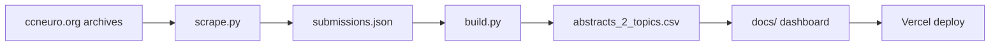

# CCN Visualizer — guide

[README](../README.md) · **Live:** https://ccn-visualizer.vercel.app/

## Workflow



```bash
pip install -r requirements.txt && cp .env.example .env
python scripts/scrape.py && python scripts/build.py
```

Push `main` → Vercel serves `docs/`. Commit `docs/data/abstracts_2_topics.csv` after rebuilds.

## Data

Dashboard runtime loads only `docs/data/abstracts_2_topics.csv`.

| Source | Use |
|--------|-----|
| [ccneuro.org](https://ccneuro.org) (2017–2026) | Titles, authors, abstracts, keywords |
| [CCN 2026 Activity Preferences](https://docs.google.com/forms/d/1c-ZR7PkUNDVeRmncAK2nmdKA5ZwuZ8opTr8Brl-WOJI/viewform) form | 14 research theme names |

## Themes & map

- **Themes:** assigned offline via Anthropic in `build.py` (cached in `data/llm_theme_cache.json`). Dominant + secondary topics; list filter matches any topic.
- **UMAP:** TF-IDF + UMAP layout only. Dot position = text similarity; dot color = conference year. Does not set theme labels.

Keyword/text cleanup without re-running UMAP or the LLM: `python scripts/build.py --repair-only`
