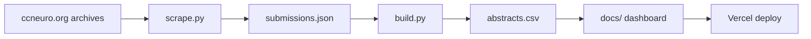

# CCN Visualizer — guide

[README](../README.md) · **Live:** https://ccn-visualizer.vercel.app/

## Workflow



```bash
pip install -r requirements.txt && cp .env.example .env
python scripts/scrape.py && python scripts/build.py
```

Push `main` → Vercel serves `docs/`. Commit `docs/data/abstracts.csv` after rebuilds.

**Before deployment:** manually check scraped text, theme labels, and spot-fix outliers in `abstracts.csv` / `submissions.json` (production data was cleaned this way).

## Data sources

| Source | Use |
|--------|-----|
| [ccneuro.org](https://ccneuro.org) year sites (2017–2026) | Titles, authors, abstracts, keywords, poster metadata |
| [2026.ccneuro.org](https://2026.ccneuro.org) MeetingTrakr search | 2026 listings (detail pages often lack abstracts; prior data used for carry-forward) |
| [CCN 2026 Activity Preferences](https://docs.google.com/forms/d/1c-ZR7PkUNDVeRmncAK2nmdKA5ZwuZ8opTr8Brl-WOJI/viewform) Google Form | 14 research theme names (`data/google_topics.json`) |

Dashboard runtime loads only `docs/data/abstracts.csv`.

## Theme assignment (LLM)

| | |
|--|--|
| **Provider** | [Anthropic API](https://www.anthropic.com/) |
| **Model** | `claude-opus-4-6` (override with `ANTHROPIC_MODEL` in `.env`) |
| **When** | Offline in `build.py`, one API call per uncached paper — not at dashboard runtime |
| **Cache** | `data/llm_theme_cache.json`, keyed by `year:id` (CCN reuses numeric IDs across years) |

**Per paper, the model receives:** the allowed 14 theme names, year, title, abstract, author keywords, and conference track/area when present.

**Not sent:** authors list, poster URL, or UMAP coordinates.

**Returns (JSON):** one `primary_theme` plus up to four `secondary_topics` → stored as `assigned_topics` (dominant first). Invalid or legacy labels are normalized; papers are never left untagged.

**Dashboard use:** the submission list matches any assigned topic; the UMAP map colors and highlights by **dominant topic only** (`assigned_topics[0]`). Theme assignment is independent of UMAP — clusters are not used to pick labels.

## UMAP map (layout only)

Computed in `build.py` for all papers after text cleanup. **Does not affect theme labels.**

1. **Text per paper** — weighted concatenation: title ×2, abstract ×3, cleaned content keywords ×1 (`submission_embedding_text()` in `shared.py`; metadata-only keywords excluded).
2. **TF-IDF** — scikit-learn `TfidfVectorizer`: up to 8000 features, unigrams + bigrams, `min_df=2`, `max_df=0.95`, sublinear TF, custom stop words.
3. **UMAP** — 2D layout with `n_neighbors=15`, `min_dist=0.12`, cosine metric, `random_state=42`.
4. **Export** — `umap_x` / `umap_y` in `abstracts.csv`; coordinates also saved to `data/embeddings_all.json`.

Dot position = semantic similarity of title/abstract/keywords. Dot color = dominant LLM-assigned theme.
