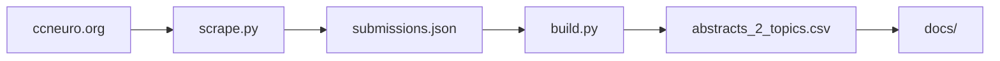

# CCN Visualizer — guide

[README](../README.md) · **Live:** https://ccn-visualizer.vercel.app/

## Pipeline



```bash
pip install -r requirements.txt && cp .env.example .env
python scripts/scrape.py && python scripts/build.py
```

Push `main` → Vercel serves `docs/`. Commit `docs/data/abstracts_2_topics.csv` after rebuilds.

## Data

- **Runtime:** `docs/data/abstracts_2_topics.csv`
- **Build:** `data/submissions.json`, `data/embeddings_all.json`, `data/google_topics.json`
- **2026 backfill:** `data/ccn-2026-pending-posters.csv`

Themes: Anthropic classification in `build.py` (cache: `data/llm_theme_cache.json`). UMAP: TF-IDF layout; dot color = year.

## Maintenance

```bash
python scripts/build.py --repair-only   # sanitize text/keywords, rewrite CSV (no API/UMAP)
python scripts/scrape.py --years 2026   # partial scrape
python scripts/build.py --skip-classify # rebuild UMAP/CSV without re-classifying
```

CI workflows **Scrape CCN Data** and **Update 2026 Data** need `ANTHROPIC_API_KEY` in repo secrets.
